# DebugRenderers

This mod activates some of the debug renderers that are present in the vanilla game code but unavailable without further modification.

**Available Debug Renderers**
* Pathfinding
* Water levels
* Chunk borders
* Heightmap
* Block collision boxes
* Block updates
* Structure boundaries
* Skylight
* Block outlines
* Chunk loading
* Bee AI
* Gametest (unknown functionality)
* Sculk/warden
* Raid centers
* Entity AI/goal selector
* Entity Brain

This mod also adds some custom renderers that I thought would be useful:
* Mob spawning attempts

# Gallery

### Pathfinding

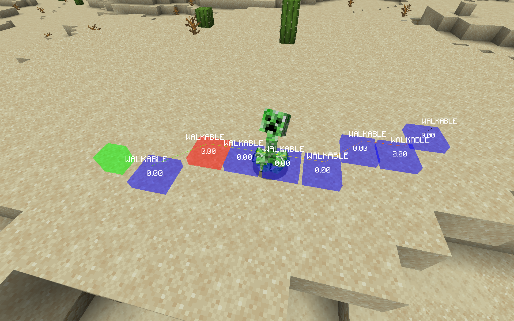

### Water

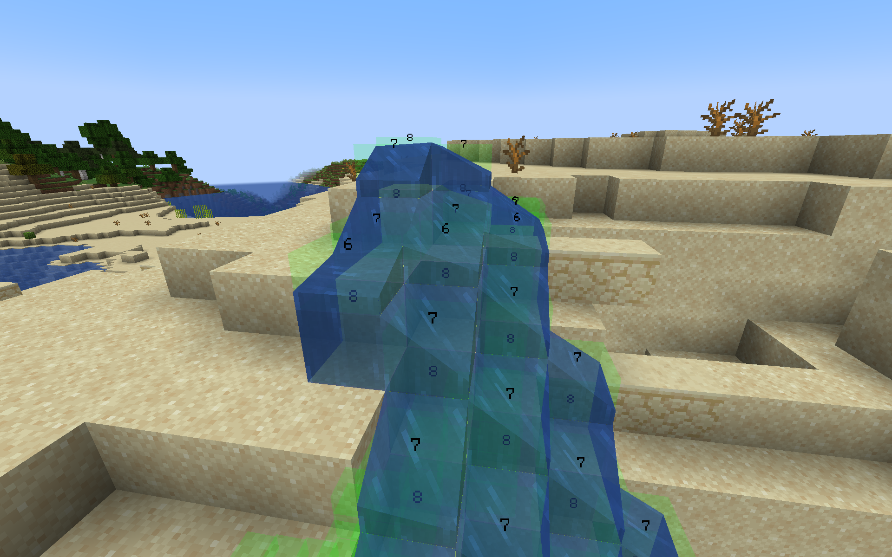

### Chunk Border

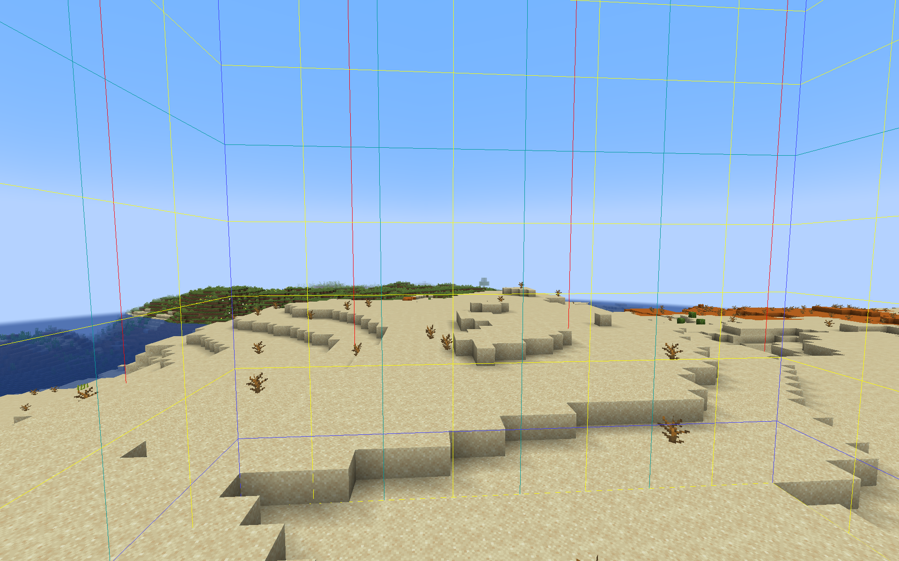

### Heightmap

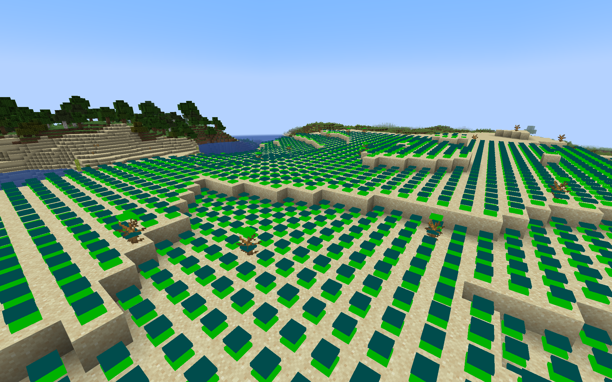

### Collision

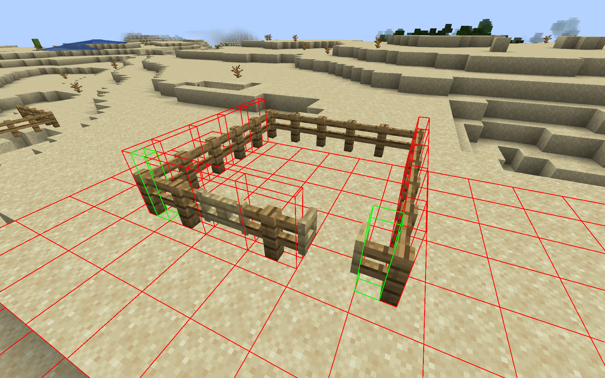

### Block Update

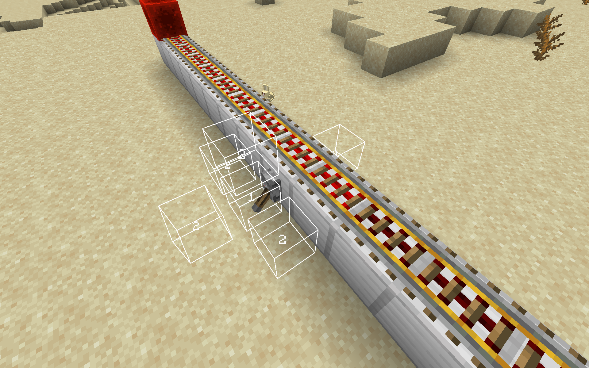

### Structure

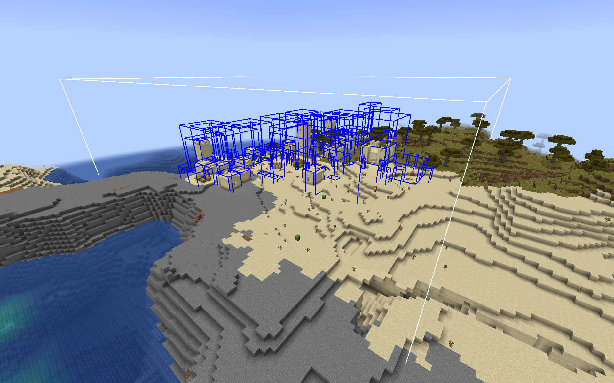

### Sky Light

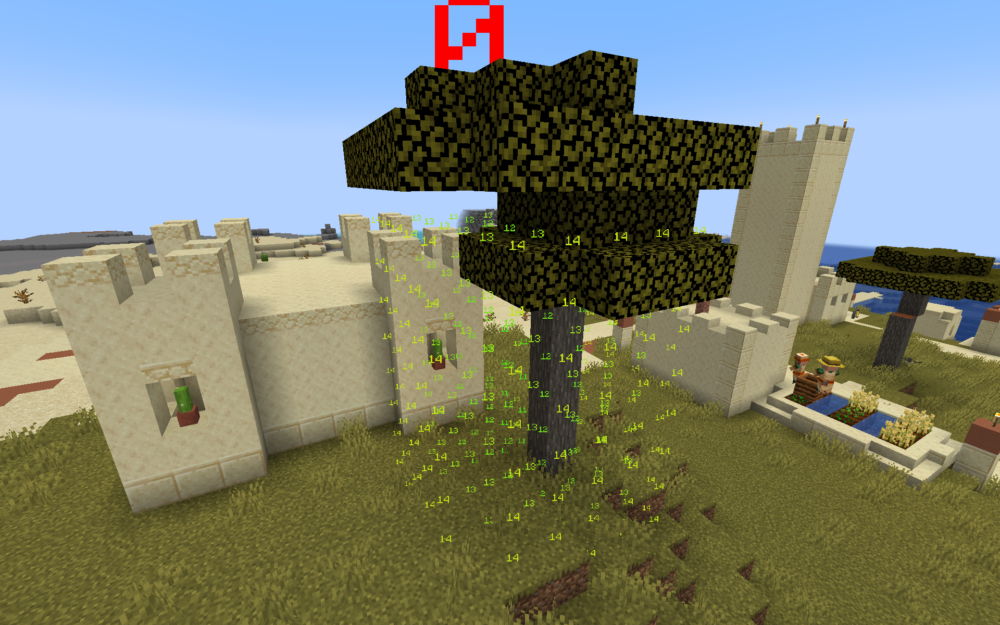

### Block Outline

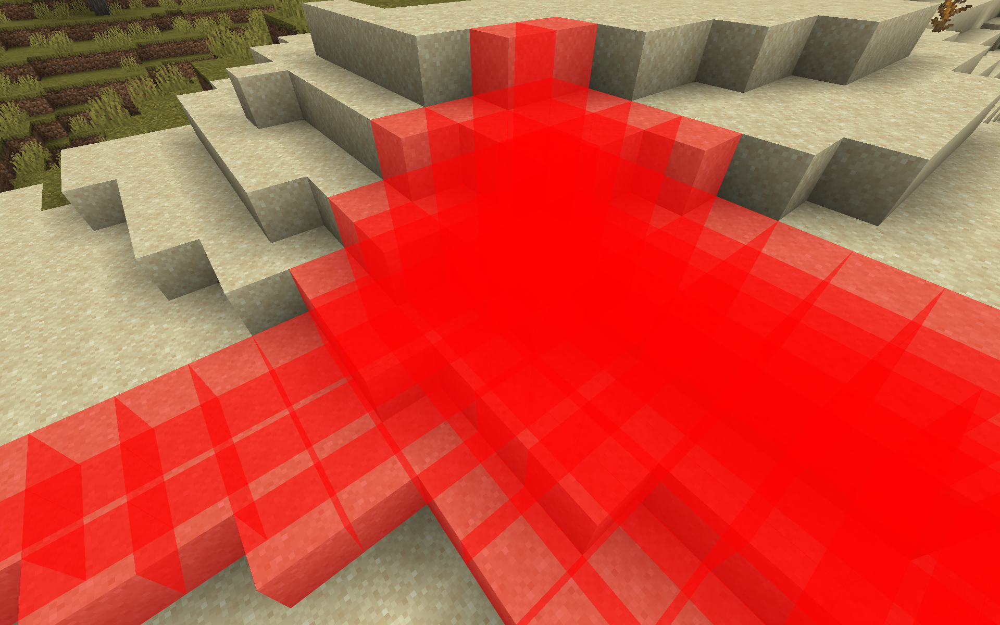

### Chunk Loading

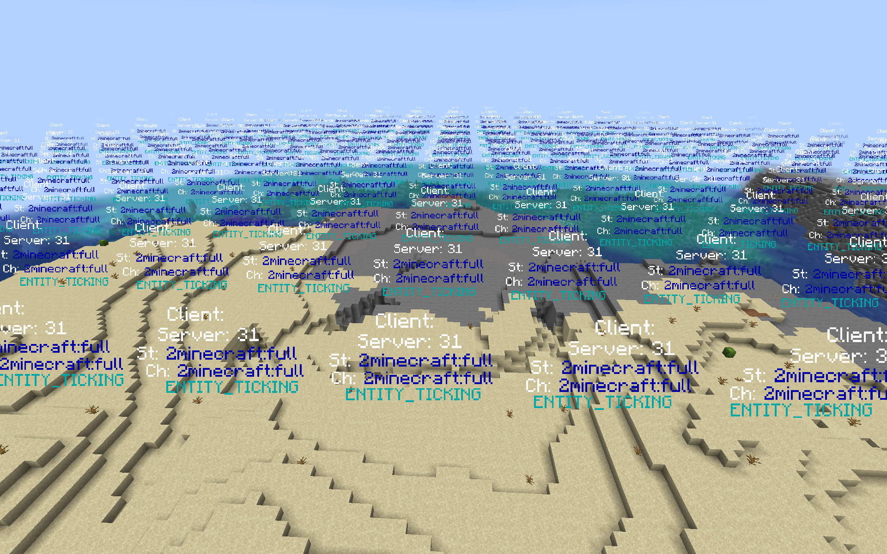

### Bee

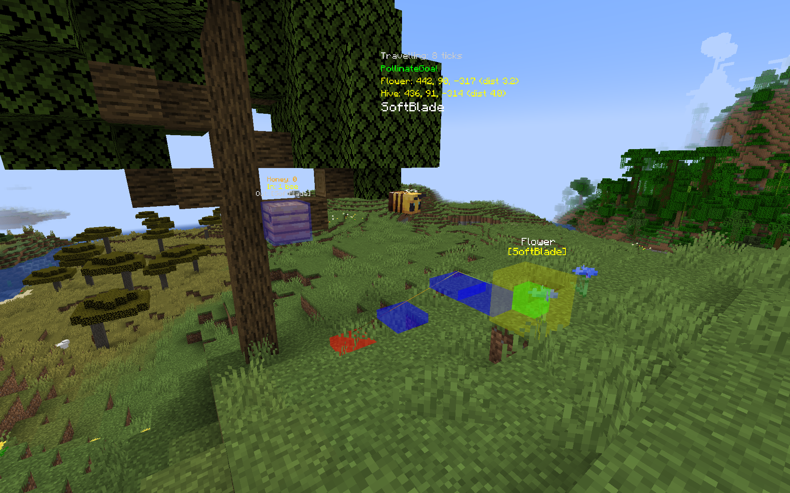

### Sculk/Warden

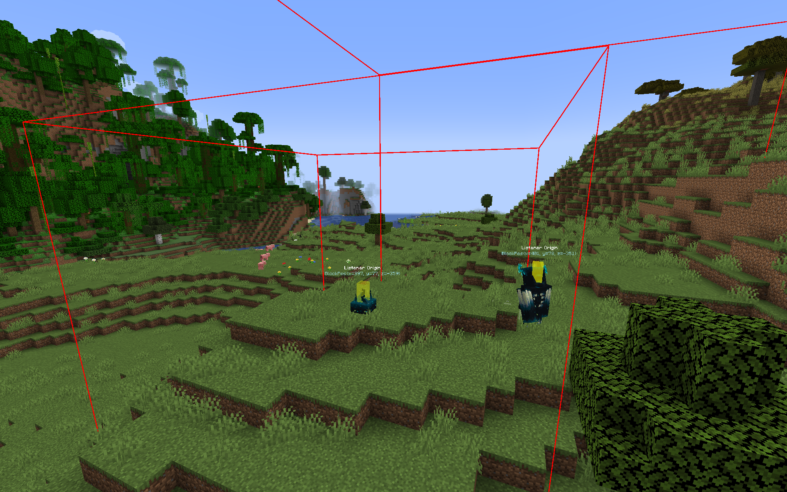

### Raid Center

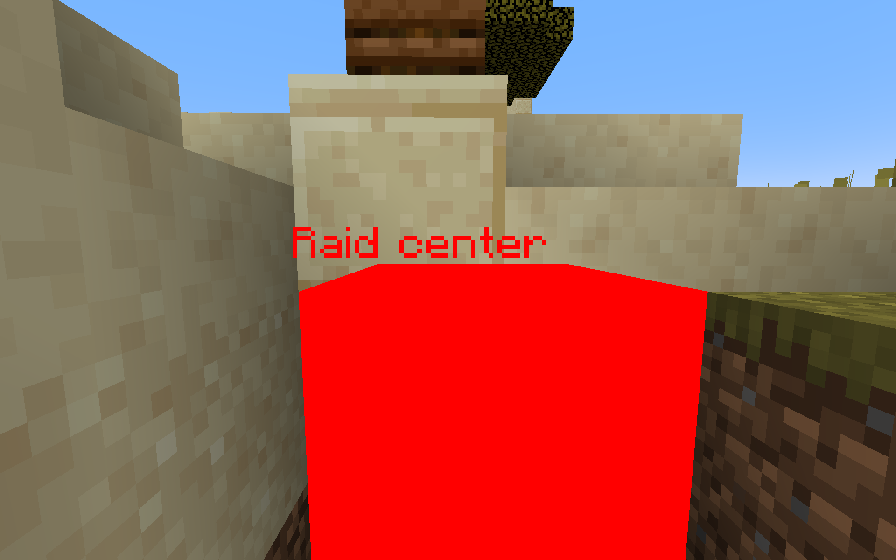

### Goal Selector

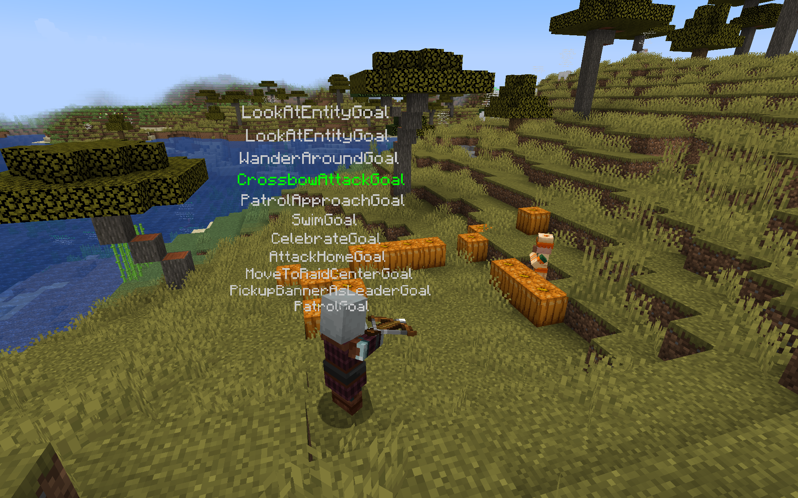

### Brain

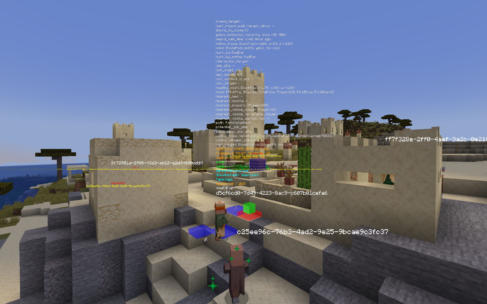

### Spawn Attempts

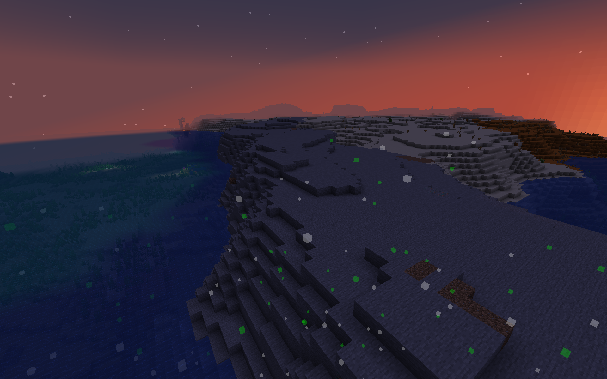